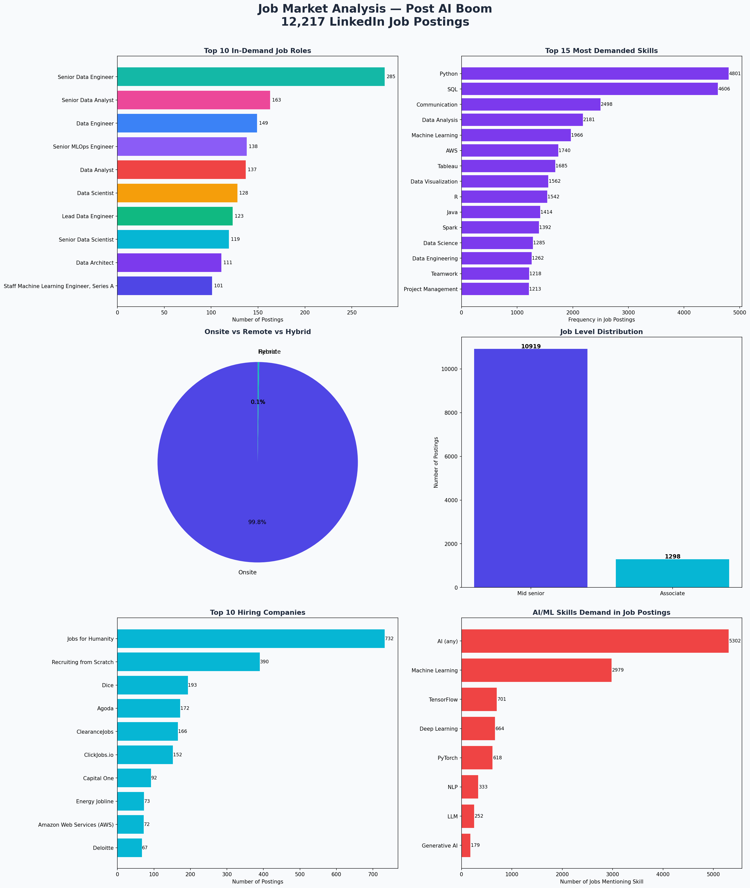

# 📊 Job Market Analysis — Post AI Boom

> Analyzing 12,000+ LinkedIn job postings to uncover what skills, roles, and trends define the data job market in the AI era.

---

## 🎯 Problem Statement

How has AI reshaped hiring in the data industry? Which roles are most in demand, what skills do employers want, and how has the market evolved in 2024?

---

## 📁 Dataset

| File | Rows | Description |
|------|------|-------------|
| `job_postings.csv` | 12,217 | Job title, company, location, job level, job type |
| `job_skills.csv` | 12,217 | Skills required per job posting |
| `job_summary.csv` | 12,217 | Full job description text |

**Source:** LinkedIn Job Postings via Kaggle  
**Time Period:** January 2024

---

## 🛠️ Tools Used

- **Python** — Data cleaning, EDA, visualization (Pandas, Matplotlib, Seaborn)
- **SQL** — Querying and aggregation
- **Power BI** — Interactive dashboard
- **Excel** — Initial data exploration

---

## 🔍 Key Findings

1. **Python & SQL dominate** — Python appears in 4,801 jobs and SQL in 4,606, making them the #1 and #2 most demanded skills
2. **AI is everywhere** — 5,302 out of 12,217 job postings (43%) mention AI-related skills
3. **Senior Data Engineer** is the most in-demand role with 285 postings
4. **Onsite still rules** — 99.7% of jobs are onsite; remote data jobs remain rare
5. **Mid-Senior roles dominate** — 89% of postings are Mid-Senior level, suggesting the market favors experienced professionals

---

## 📊 Visualizations



Charts include:
- Top 10 in-demand job roles
- Top 15 most demanded skills
- Onsite vs Remote vs Hybrid breakdown
- Job level distribution
- Top 10 hiring companies
- AI/ML skills demand

---

## 🚀 How to Run

```bash
# Clone the repo
git clone https://github.com/yourusername/job-market-analysis.git
cd job-market-analysis

# Install dependencies
pip install pandas matplotlib seaborn

# Run the analysis
python job_market_analysis.py
```

---

## 📂 Project Structure

```
job-market-analysis/
│
├── job_postings.csv          # Raw job data
├── job_skills.csv            # Skills data
├── job_summary.csv           # Job descriptions
├── job_market_analysis.py    # Main analysis script
├── sql_queries.sql           # SQL analysis queries
├── job_market_analysis.png   # Output charts
└── README.md                 # This file
```

---

## 👤 Author

**Your Name**  
Aspiring Data Analyst | Python • SQL • Power BI  
[LinkedIn](https://linkedin.com/in/yourprofile) | [GitHub](https://github.com/yourusername)
